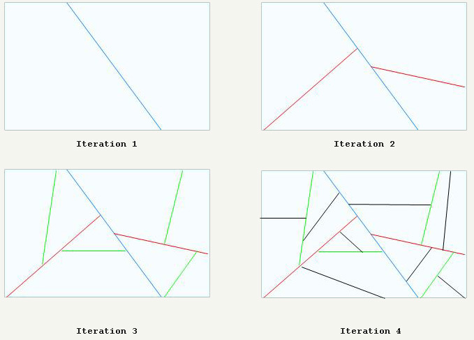
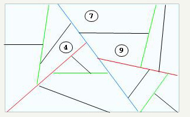
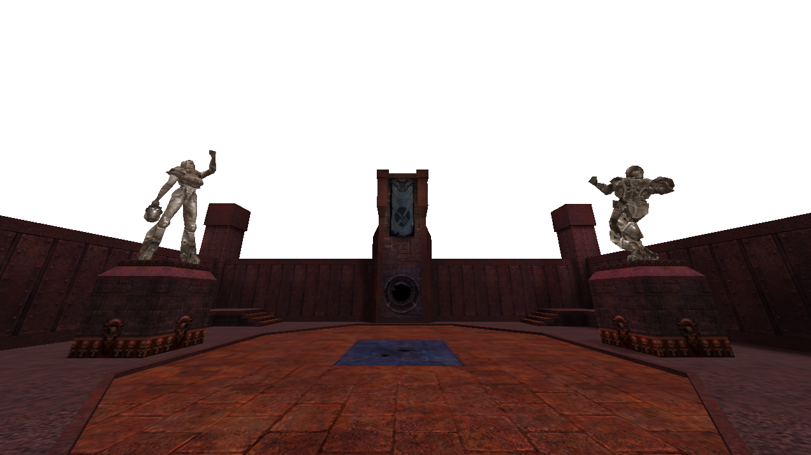
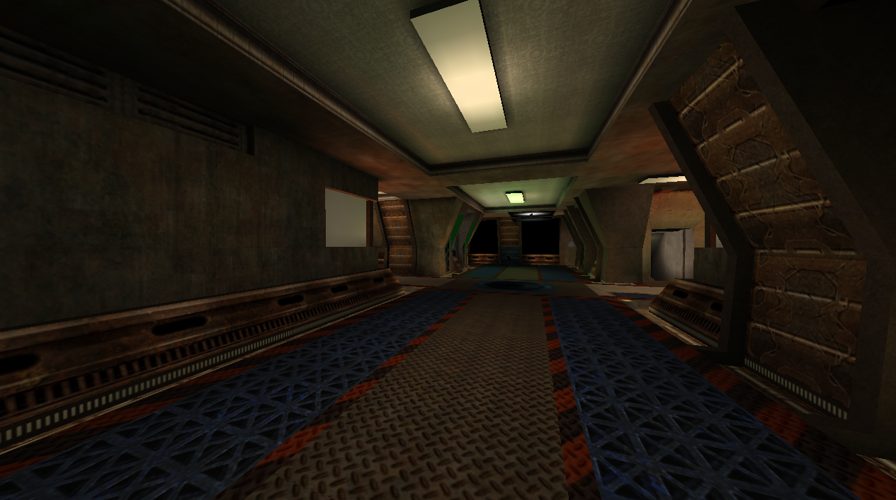
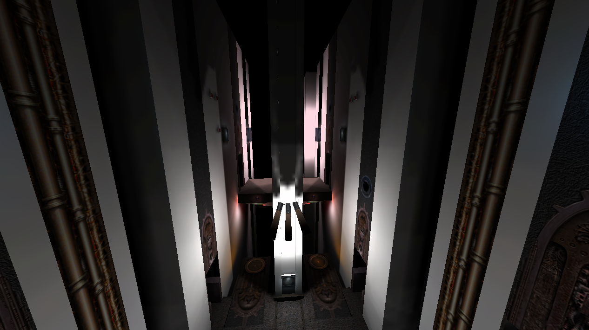

# Задание

Разработать ПО, которое умеет читать файлы карт игры Quake 3 в формате BSP,
отображать их и позволять перемещаться по ним с учетом проверки столкновения
твердыми поверхностями.

# Формат карт BSP

файл BSP хранит набор секций, хранящих различные структуры данных, описывающих
карту:

- Сущности	-- Информация о различных игровых объектах.

- Текстуры  -- Описание типа поверхности.

- Плоскости -- Набор плоскостей.

- Узлы      -- Узлы дерева BSP.

- Листья    -- Листья дерева BSP.

- Поверхности листьев -- список индексов, определяющий соответствие листа и его поверхности.

- Кисти листьев -- список индексов, определяющий соответствие листа и его кисти.

- Модели   --  Описания моделей карты, таких как двери, платформы и т. д.

- Кисть -- 	Выпуклый многогранник использующийся для проверки столкновений.

- Поверхности кистей -- Список поверхностей кистей.

- Вершины 	-- Набор вершин.

- Индексы вершин --  Список индексов вершин.

- Эффекты -- Список эффектов.

- Поверхности --  Описания геометрии различных поверхностей.

- Карты освещения

- Освещение моделей

- Информация о видимости одного кластера из другого.

# Описание процесса отрисовки карты

Карты Quake 3 проходят через сильную предварительную обработку.
В основе этой обработки лежит алгоритм двоичного разбиения пространства.

Согласно этому алгоритму карты разрезаются следующим образом:

Этот процесс создает BSP с листьями согласно следующим правилам:

выбрать существующий полигон в качестве секущей плоскости и выбрать разделитель,
разрезающий меньшее количество полигонов.

После создания BSP для каждого листа вычисляется PVS
(Potentially Visible Set, потенциально видимый набор).
Пример: лист 4 может потенциально видеть листья 7 и 9:

Окончальный PVS для этог листа сохраняется как битовый вектор:

Ид. листа       1 2 3 4 5 6 7 8 9 10 11 12 13 14 15 16
--------------- - - - - - - - - - -- -- -- -- -- -- --
PVS для листа 4 0 0 0 1 0 0 1 0 1 0  0  0  0  0  0  0
--------------- - - - - - - - - - -- -- -- -- -- -- --

В результате получался глобальный PVS размером примерно 5МБ.

Потом он сжимался с помощью компрессии разности длин.

Сжатый PVS для листа 4: 3 2 1 7

Закодированный PVS содержал только количество нулей между единицами,
что позволяло сократить размер PVS до 20 КБ.

## Процедура визуализации карты

Благодаря наличию предварительно рассчитанных BPS и PVS процедура визуализации
карты значительно упрощается и состоит из следующих шагов:

- Обход BSP для определения того, на какой лист направлена камера.

- Извлечение и распаковка PVS для этого листа, итеративный проход по PVS
и пометка листьев в BSP.

- Обход BSP, начиная от ближних к дальним.

- Если узел (Node) не помечен, то он пропускается.

- Добавление текущего листа в список визуализации.

# Результат

